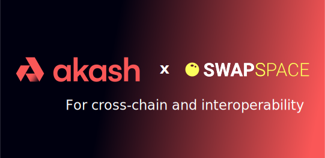

# Akash Console Augmented

Akash Console Augmented is an improved release of akash console. A user-friendly tool for buy computing resources with many coins **(like ETHER, MATIC, BNB, TRX ...)** as the exchange pair &nbsp;-- / AKT is available on [SWAPSPACE](https://swapspace.co/) without leave your favorite wallet like **Metamask, Coinwallet ...**  . Try a running instance of Akash Console Augmented at https://console.akash.network/.

<p align="center">
  
</p>


## Running it locally

Please ensure you have the below set of dependencies installed on your workstation:

* node 18+
* yarn (1.22.19)
* concurrently (7.2.2)
* craco (6.4.4)

You can install dependencies by running
```
npm install -g yarn concurrently craco
```
Then checkout, build and run Console
```
git clone https://github.com/akash-network/console.git
cd console
yarn install
yarn dev
```

Note for MacOS

If you see errors regarding port 5000 being in use, this is due to AirPlay
using the port. You can disable this service in the MacOS Sharing settings.
